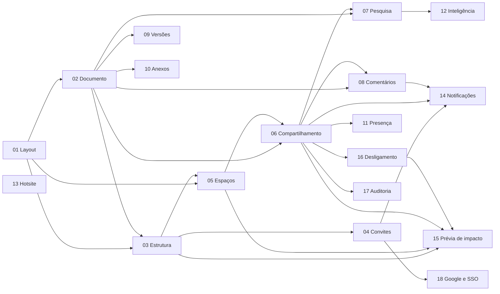

# Refactor da Folioteca — índice e ordem de execução

Esta pasta é **o plano da aplicação**. Substitui o roadmap, os estágios e o
harness que existiam antes de 10/09/2026. Cada funcionalidade é um plano, em
corte vertical (modelo de dados, API, tela, testes e deploy no mesmo plano), e
cada plano termina com algo que o dono vê e testa.

## Como executar numa sessão nova

1. Leia `00-fundamentos/decisoes.md` (a stack e as escolhas fechadas),
   `00-fundamentos/convencoes-dos-planos.md` (o molde e as regras da casa) e o
   `CLAUDE.md` do repositório (regras de código). Não leia o resto da pasta
   `00-fundamentos/` sem precisar: os planos citam o que importa.
2. Pegue o **primeiro plano não entregue** da tabela abaixo cujas dependências
   estejam entregues. Abra o `PLANO.md` dele e siga o to-do na ordem.
3. Marque cada tarefa `[x]` ao terminar, e acrescente uma linha em
   **Andamento** ao fim de cada etapa. O plano é o registro; não há outro.
4. Um plano é uma branch `feat/NN-slug` a partir de `develop` e um PR. Etapas
   são commits. O merge só acontece quando o dono pedir, por
   `bash scripts/merge-se-liberado.sh <número>` na raiz. Merge na `develop`
   publica em homologação (`https://hml.folioteca.duckdns.org`).
5. Decisão que o plano não cobre: decida pelo `decisoes.md` e pelo
   `modelo-de-acesso.md`, prefira a opção mais comum e reversível, e registre
   em **Andamento**. Volta ao dono só o que é irreversível ou para fora.
6. Ao terminar o plano, atualize a coluna de status desta tabela.

## Ordem de execução

Ordenada por valor visível e dependência. Os planos marcados ‖ podem correr em
paralelo com o anterior, em worktrees separadas, porque não tocam os mesmos
arquivos.

| # | Plano | Entrega visível | Depende de | Status |
|---|---|---|---|---|
| 01 | [Layout e navegação](01-layout-e-navegacao/PLANO.md) | A aplicação com barra lateral única, início, árvore de espaços e página de documento, com dados de exemplo | — | [[x] |
| 02 | [Documento e editor](02-documento-e-editor/PLANO.md) | Criar, escrever em blocos com salvamento colaborativo (Yjs), favoritar, lixeira; "Meus documentos" de verdade | 01 | [[x] |
| 03 | [Estrutura organizacional](03-estrutura-organizacional/PLANO.md) | Instalação com código, unidades em árvore, lotação de pessoas, tela de Organização, papéis | 01, 02 | [[x] |
| 04 | [Convites](04-convites/PLANO.md) | Convidar por e-mail, aceite com senha, cadastro público fechado | 03 | [ ] |
| 05 | [Espaços](05-espacos/PLANO.md) | Espaço por unidade e espaço livre, membros, herança, restrito; a árvore da barra lateral de verdade | 01, 03 | [ ] |
| 06 | [Compartilhamento](06-compartilhamento/PLANO.md) | Diálogo de compartilhar com alvos e níveis, prévia de audiência, "quem vê", "compartilhados comigo", lista do espaço; toda decisão de acesso no servidor | 02, 05 | [ ] |
| 07 | [Pesquisa](07-pesquisa/PLANO.md) | Busca por texto filtrada por acesso, com trecho e realce; busca rápida na barra lateral | 02, 06 | [ ] |
| 08 | [Comentários](08-comentarios/PLANO.md) | Comentar ancorado no trecho, thread, resolver, mencionar | 02, 06 | [ ] |
| 09 | [Histórico de versões](09-historico-de-versoes/PLANO.md) | Versões, comparar, restaurar; contribuintes | 02 ‖ 08 | [ ] |
| 10 | [Anexos e imagens](10-anexos-e-imagens/PLANO.md) | Imagem e arquivo no documento, armazenamento S3, avatar | 02 ‖ 09 | [ ] |
| 11 | [Presença e robustez do tempo real](11-colaboracao-em-tempo-real/PLANO.md) | Quem está no documento, cursores com nome, reconexão e modo só leitura ao vivo; limites e carga | 02, 06 | [ ] |
| 12 | [Inteligência](12-inteligencia/PLANO.md) | Chave e modelo escolhidos pela organização, indexação por bloco, conversa sobre documentos selecionados com citação que abre no bloco | 07 | [ ] |
| 13 | [Hotsite](13-hotsite/PLANO.md) | Página de apresentação nova, no padrão da referência, com o design system | — ‖ qualquer | [ ] |
| 14 | [Notificações](14-notificacoes/PLANO.md) | Sino com menções, comentários, compartilhamentos e convites; e-mail de resumo | 04, 06, 08 | [ ] |
| 15 | [Prévia de impacto na estrutura](15-previa-de-impacto-na-estrutura/PLANO.md) | Antes de mover pessoa ou apagar unidade, quem ganha e quem perde acesso | 03, 05, 06, 16 | [ ] |
| 16 | [Desligamento e propriedade](16-desligamento-e-propriedade/PLANO.md) | Desativar pessoa com revogação no ato, documentos para a administração, transferência de propriedade com aceite | 06 | [ ] |
| 17 | [Auditoria de acesso](17-auditoria-de-acesso/PLANO.md) | Quem viu o quê, quem compartilhou com quem, exportável | 06 | [ ] |
| 18 | [Login com Google e SSO](18-login-google-e-sso/PLANO.md) | Entrar com Google; SSO corporativo (SAML/OIDC) por organização | 04 | [ ] |

## O que fica de fora, de propósito

- **Link público de documento.** Contradiz o modelo: o acesso vem de onde a
  pessoa está na organização. Se um dia entrar, entra como plano novo com a
  auditoria (17) já entregue.
- **Modelos de documento (templates), importação e exportação (Markdown,
  DOCX, PDF), integração com Slack/Teams, aplicativo móvel.** Valem, mas não
  antes dos 18 acima. Viram plano quando o dono pedir.
- **Cargo e função, mover unidade, importação de estrutura por planilha,
  regras por tipo de unidade.** O `modelo-de-acesso.md` já os deixa de fora.

## Mapa de dependências

## Conteúdo de `00-fundamentos/`

| Arquivo | O que é |
|---|---|
| `decisoes.md` | Stack, editor, tempo real, pesquisa, IA, e-mail, armazenamento, autenticação: a escolha, o porquê e o custo de cada uma |
| `convencoes-dos-planos.md` | O molde do `PLANO.md`, as regras dos critérios de aceite e as regras da casa |
| `modelo-de-acesso.md` | M1–M20: instância, estrutura, espaços, documentos e acesso, fechado pelo dono |
| `estado-atual.md` | O que o código tem hoje, o que é reaproveitado e o que falta |
| `pesquisa/outline.md`, `affine.md`, `appflowy.md`, `docmost.md` | Engenharia reversa de funcionalidade das referências |
| `pesquisa/tecnologias.md` | Versões, licenças e pegadinhas das bibliotecas, medidas em 11/09/2026 |
| `pesquisa/sintese.md` | O que a Folioteca leva de cada referência, por mecânica, e onde faz melhor |
| `revisao-cruzada.md` | Revisão de consistência entre os 18 planos (11/09/2026): o que foi alinhado e o que ficou para o dono |
| `revisao-forma.md` | Revisão de forma e de critérios de aceite (11/09/2026): o que foi corrigido em cada plano |

## Lembretes para depois de tudo pronto

Anotações do dono, sem plano e sem prazo: entram só quando os 18 planos acima
estiverem entregues.

### Blocos personalizados do editor (anotado em 11/09/2026)

**Licença.** ProseMirror e TipTap são MIT: uso comercial livre, código da
aplicação pode ficar fechado, a única exigência é manter o aviso de direitos
autorais nos arquivos da biblioteca (o npm já faz). O BlockNote, que
escolhemos e que roda em cima deles, é MPL-2.0 no core — mesma liberdade para
o nosso código. Bloco que escrevemos em `packages/editor` pela API pública
(`createReactBlockSpec`, `createReactInlineContentSpec`) é código nosso, e não
precisa ser distribuído.

Os quatro blocos, do mais barato ao mais caro:

1. **Menção de pessoa (`@nome`) no corpo do documento.** Complexidade baixa.
   O plano 08 já entrega menção dentro de comentários; aqui é dentro do
   texto. No BlockNote é um *inline content* personalizado com o menu de
   sugestão (`SuggestionMenuController` com gatilho `@`), listando quem tem
   acesso ao documento (a mesma rota `GET /documents/:id/audience` do plano
   06). Equivalente ao `@tiptap/extension-mention`, que o BlockNote não expõe
   direto.
2. **Bloco de destaque (callout / aviso).** Complexidade baixa. Um bloco
   com `content: "inline"`, uma propriedade `tone` (informação, atenção,
   sucesso, erro) e a cor de fundo pelos tokens do tema; marca inline na
   lateral, desenhada na casa.
3. **Bloco de data com calendário.** Complexidade média. Bloco com
   `content: "none"` e a data numa propriedade (`props.date`, ISO), renderizado
   por um componente React com o seletor de data da casa (Ark UI `DatePicker`,
   já disponível — não shadcn). Salva estático no JSON do documento; sem
   lógica de agenda.
4. **Layout em colunas.** Complexidade média para alta. **Atenção:** o pacote
   oficial `@blocknote/xl-multi-column` é GPL-3.0 e está proibido no lockfile
   (decisão 3). Terá de ser escrito na casa: dois blocos (`columnList` com
   `children` de `column`) e as regras de teclado para andar entre colunas
   com as setas. Há exemplos abertos para TipTap que servem de referência de
   mecânica, nunca de código copiado sob GPL.

Onde entram quando chegar a hora: o esquema da casa em `packages/editor`
(plano 02), sem tocar na API nem no modelo de dados — o JSON de blocos já
aceita tipos novos.

### Escala para contratantes de qualquer tamanho (ressalva às decisões 5 e 6, anotada em 11/09/2026)

O dono aprovou as decisões 5 (acesso calculado por funções SQL no servidor) e
6 (pesquisa no próprio Postgres) **para a V1**, com uma ressalva: a Folioteca
vai ser vendida a contratantes de tamanho desconhecido e precisa estar pronta
para qualquer um. Por isso **a V2 começa propondo o refactor** que leve acesso
e pesquisa a grandes volumes de dados e de pessoas. Sem plano agora; o que a
proposta precisa trazer:

- **Medida antes da escolha.** Carga sintética no tamanho do maior contratante
  em vista (pessoas, unidades, espaços, documentos, blocos), com o tempo de
  `document_access`, da listagem e da pesquisa medido. O refactor ataca o que
  a medida apontar.
- **Acesso.** Na V1, a audiência de cada pessoa é calculada na hora, a cada
  consulta, pelas funções SQL da decisão 5. Caminhos a avaliar: tabela de
  acesso pré-calculada e atualizada quando o acesso muda, cache por pessoa, ou
  um serviço de autorização no modelo Zanzibar (OpenFGA, SpiceDB).
- **Pesquisa.** Na V1, é o full-text do Postgres (GIN, `pg_trgm`) e os vetores
  no pgvector com índice HNSW. Caminhos a avaliar: réplica de leitura dedicada
  à pesquisa e um motor à parte (OpenSearch, Meilisearch, Typesense),
  alimentado a cada documento salvo, como o índice de embeddings do plano 12
  já é.
- **O que já ajuda.** Cada contratante tem a própria instância (M1), então o
  volume a suportar é o do maior contratante sozinho, e não a soma de todos.
  E todo acesso passa pelas mesmas funções SQL (`document_access` e as outras
  duas da decisão 5): trocar o que elas fazem por dentro — ler uma tabela
  pré-calculada, por exemplo — não muda nenhum plano de funcionalidade.
